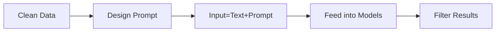

---
# try also 'default' to start simple
theme: seriph
# random image from a curated Unsplash collection by Anthony
# like them? see https://unsplash.com/collections/94734566/slidev
background: https://source.unsplash.com/collection/94734566/1920x1080
# apply any windi css classes to the current slide
class: 'text-center'
# https://sli.dev/custom/highlighters.html
highlighter: shiki
# show line numbers in code blocks
lineNumbers: false
# some information about the slides, markdown enabled
info: |
  ## ChatGPT Robustness
  Presentation slides for developers.

  Learn more at [Sli.dev](https://sli.dev)
# persist drawings in exports and build
drawings:
  persist: false
# page transition
transition: slide-left
# use UnoCSS
css: unocss
---

# ChatGPT Robustness

An Adversarial and Out-of-distribution Perspective

<div class="pt-12">
  <span @click="$slidev.nav.next" class="px-2 py-1 rounded cursor-pointer" hover="bg-white bg-opacity-10">
    Let's start the journey <carbon:arrow-right class="inline"/>
  </span>
</div>

<div class="abs-br m-6 flex gap-2">
  <button @click="$slidev.nav.openInEditor()" title="Open in Editor" class="text-xl slidev-icon-btn opacity-50 !border-none !hover:text-white">
    <carbon:edit />
  </button>
  <a href="https://github.com/slidevjs/slidev" target="_blank" alt="GitHub"
    class="text-xl slidev-icon-btn opacity-50 !border-none !hover:text-white">
    <carbon-logo-github />
  </a>
</div>

<!--
The last comment block of each slide will be treated as slide notes. It will be visible and editable in Presenter Mode along with the slide. [Read more in the docs](https://sli.dev/guide/syntax.html#notes)
-->

---
transition: fade-out
---

# What is ChatGPT? (General Version)
<div v-click>
      ChatGPT is an AI language model developed by OpenAI to interact in a conversational way.
</div>
<div v-click>
      <p>📝 <strong>The most exciting technology ever!</strong> - focus on the content with Markdown, and then style them later</p>
      <p>🎨 <strong>Built on transformers.</strong> - this helps to learn from large volumes of text and identify key points</p>
      <p>🧑‍💻 <strong>Trained on massive amounts of data</strong> - this enables it to generate high-quality responses to you!</p>
      <p>🤹 <strong>Interactive</strong> - it can answer followup questions, admit its mistakes, challenge incorrect premises, and reject inappropriate requests in a human-like way!</p>
</div>
<div v-click>
      However, it also has a lot of drawbacks.
</div>
<div v-click>
      <p>🎥 <strong>Bias</strong> - it can generate biased or inappropriate responses if not treated well</p>
      <p>📤 <strong>Missleading</strong> - it will sometimes generate false answer while still pretending it is right</p>
      <p>🛠 <strong>Non-omnipotent</strong> - it has limited domain-specific knowledge</p>
      <p>😈 <strong>Vulnerability</strong> - it can be misguided by malicious users to generate harmful responses</p>
    </div>

<style>
h1 {
  background-color: #2B90B6;
  background-image: linear-gradient(45deg, #4EC5D4 10%, #146b8c 20%);
  background-size: 100%;
  -webkit-background-clip: text;
  -moz-background-clip: text;
  -webkit-text-fill-color: transparent;
  -moz-text-fill-color: transparent;
}
</style>

<!--
Here is another comment.
-->
---
transition: fade-out
---

# What is ChatGPT? (Technical Version)

1. GPT (Generative Pre-trained **Transformer**)
2. ChatGPT is <span style="color: blue;"><i>fine-tuned</i></span> from a model in the **GPT-3.5 series**  
<!-- GPT-3.5 series is a series of models that was trained on text and code before **Q4 2021**   
  - `code-davinci-002` is a base model, so good for pure code-completion tasks
  - `text-davinci-002` is an InstructGPT model based on code-davinci-002
  - `text-davinci-003` is an improvement on text-davinci-002 -->
<div style="border-left:2px solid gray; padding-left:10px;">
GPT-3.5 series is a series of models that was trained on text and code before <strong>Q4 2021</strong>  
<ul>
  <li><code style="background-color: #f4f4f4; padding: 4px; border-radius: 4px;">code-davinci-002</code> is a base model, so good for pure code-completion tasks</li>
  <li><code style="background-color: #f4f4f4; padding: 4px; border-radius: 4px;">text-davinci-002</code> is an InstructGPT model based on code-davinci-002</li>
  <li><code style="background-color: #f4f4f4; padding: 4px; border-radius: 4px;">text-davinci-003</code> is an improvement on text-davinci-002</li>
</ul>
</div>

<!-- Based on this information, we selected our baseline models to compare their performance with that of ChatGPT.

<div style="border-left:2px solid gray; padding-left:10px;">  
<ul>
  <li><code style="background-color: #f4f4f4; padding: 4px; border-radius: 4px;">RoBERTa-L (560 M)</code> </li>
  <li><code style="background-color: #f4f4f4; padding: 4px; border-radius: 4px;">BART-L (407 M)</code> </li>
  <li><code style="background-color: #f4f4f4; padding: 4px; border-radius: 4px;">BERT-L (335 M)</code> </li>
</ul>
</div> -->


<style>
h1 {
  background-color: #2B90B6;
  background-image: linear-gradient(45deg, #4EC5D4 10%, #146b8c 20%);
  background-size: 100%;
  -webkit-background-clip: text;
  -moz-background-clip: text;
  -webkit-text-fill-color: transparent;
  -moz-text-fill-color: transparent;
}
</style>
---
transition: slide-up
---
# History
<div style="position: absolute; top: 200px; left: 55px;">2017 <br>Transformer</div>
<div style="position: absolute; top: 200px; left: 190px;">2018.10<br> BERT</div>
<div style="position: absolute; top: 200px; left: 430px;">2020.6 <br> GPT-3</div>
<div style="position: absolute; top: 200px; left: 680px;">2022.11 <br> ChatGPT</div>
<svg class="svg-center2">
    <text class="hollow-text" x=425 y="25%" text-anchor="middle" style="z-index: 1;">Pretrained & Finetune</text>
    <text class="hollow-text" x=715 y="25%" text-anchor="middle" style="z-index: 1;">Prompt & ZeroShot</text>
  </svg>
<div class="container">
  <div class="bg-box"></div> <!-- 背景黄色 -->
  <div class="bg-box2"></div> <!-- 背景紫色 -->
  <svg class="svg-center" width="1000" heigth="50" style="z-index: 0;">
    <line x1="0" y1="25" x2="800" y2="25" stroke="#CCCCCC" stroke-width="25" />
    <polygon points="800,0 830,25 800,50" fill="#CCCCCC" />
    <line x2="45" y2="0" x1="45" y1="15" stroke="#000000" stroke-width="2" /> <!-- 上 -->
    <line x2="150" y2="0" x1="150" y1="15" stroke="#000000" stroke-width="2" /> <!-- 上 -->
    <line x2="100" y2="35" x1="100" y1="50" stroke="#000000" stroke-width="2" /> <!-- 下 -->
    <line x2="40%" y2="0" x1="40%" y1="15" stroke="#000000" stroke-width="2" /> <!-- 上 -->
    <line x2="30%" y2="35" x1="30%" y1="50" stroke="#000000" stroke-width="2" /> <!-- 下 -->
    <line x2="65%" y2="0" x1="65%" y1="15" stroke="#000000" stroke-width="2" /> <!-- 上 -->
  </svg>
  <svg class="svg-line" style="z-index: 1;">
    <line x1="25%" y1="0" x2="25%" y2="100%" stroke="#CCCCCC" stroke-width="2" stroke-dasharray="5,5" />
  </svg>
  <svg class="svg-line" style="z-index: 1;">
    <line x1="60%" y1="0" x2="60%" y2="100%" stroke="#CCCCCC" stroke-width="2" stroke-dasharray="5,5" />
  </svg>
  <svg class="star-svg" viewBox="0 0 100 100">
    <polygon points="50,5 63,30 90,35 70,57 75,85 50,75 25,85 30,57 10,35 37,30" />
    <text x="50" y="55" class="star-text">Our focus!</text>
  </svg>
</div>
<div style="position: absolute; top: 320px; left: 130px;">2018.6 <br>GPT-1</div>
<div style="position: absolute; top: 320px; left: 330px;">2019.2 <br>GPT-2</div>

<style>
h1 {
  background-color: #2B90B6;
  background-image: linear-gradient(45deg, #4EC5D4 10%, #146b8c 20%);
  background-size: 100%;
  -webkit-background-clip: text;
  -moz-background-clip: text;
  -webkit-text-fill-color: transparent;
  -moz-text-fill-color: transparent;
}
.hollow-text {
  font-size: 26px;
  /* fill: transparent; */
  stroke: #000000;
  stroke-width: 2px;
  text-shadow: none;
}
.container {
  position: relative;
  width: 100%;
  height: 100%;
}
.bg-box {
  position: absolute;
  top: 0;
  left: 26%;
  width: 33%;
  height: 80%;
  z-index: -1;
  background-color: #F7D154;
}
.bg-box2 {
  position: absolute;
  top: 0;
  left: 61%;
  width: 30%;
  height: 80%;
  z-index: -1;
  background-color: #E6E6FA;
}
.svg-center {
  position: absolute;
  top: 35%;
  left: 0%;
  /* transform: translate(-50%, -50%); */
}
.svg-center2 {
  position: absolute;
  top: 20%;
  left: 0%;
  width: 100%;
  /* transform: translate(-50%, -50%); */
}

.svg-line {
  position: absolute;
  top: 0;
  left: 0;
  width: 100%;
  height: 80%;
}
.star-svg {
  position: fixed;
  bottom: 22%;
  right: 22%;
  width: 100px;
  height: 100px;
  
}

.star-svg polygon {
  fill: #FFD700;
  stroke: #FFD700;
  stroke-width: 2;
}
.star-text {
  fill: black;
  font-size: 12px;
  font-weight: bold;
  text-anchor: middle;
}
</style>

---
transition: slide-up
---

# Model Hub and Baseline

Our experiments built upon <span class="code">Huggingface model hub</span> and <span class="code">OpenAI API</span>.

### Huggingface model hub

|  Model name   |   Params  |
| --- | --- | 
| <span class="modelname">google/flan-t5-large</span>| 11B |
| <span class="modelname">facebook/opt-66b</span> | 66B |
| <span class="modelname">bigscience/bloom</span> | 176B |
| <span class="modelname">EleutherAI/gpt-j-6B</span> | 6B |
| <span class="modelname">EleutherAI/gpt-neox-20b</span> | 20B |
| <span class="modelname">facebook/bart-large-mnli</span> | 407M |
| <span class="modelname">cross-encoder/nli-deberta-v3-large</span> | 435M |


<!-- [^1]: [Huggingface🤗](https://huggingface.co/models)
[^2]: [OpenAI](https://openai.com/blog/openai-api) -->
<style>
  table td {
  width: 50%;
  line-height: 95%;
}
h1 {
  background-color: #2B90B6;
  background-image: linear-gradient(45deg, #4EC5D4 10%, #146b8c 20%);
  background-size: 100%;
  -webkit-background-clip: text;
  -moz-background-clip: text;
  -webkit-text-fill-color: transparent;
  -moz-text-fill-color: transparent;
}
.code {
  background-color: orange;
  padding: 0.25rem 0.5rem;
  border-radius: 0.25rem;
}
.modelname {
  background-color: #4a92ed;
  padding: 0.2rem 0.4rem;
  border-radius: 0.25rem;
}
</style>
---
transition: slide-up
---

# Model Hub and Baseline

Our experiments built upon <span class="code">Huggingface model hub</span> and <span class="code">OpenAI API</span>.

### OpenAI API

|  Model name   |   Params  |
| --- | --- | 
| <span class="modelname">text-davinci-002</span>| 175B |
| <span class="modelname">text-davinci-003</span> | 175B |
| <span class="modelname">ChatGPT</span> | 175B |

```ts {all|2|3|all} <!-- 表头数字代表了哪些地方要重点显示，index从1开始 -->
completions = openai.Completion.create(
    engine="text-davinci-002",
    prompt=input,
    max_tokens=1024,
    n=1,
    stop=None,
    temperature=0.5,
)
```

<!-- [^1]: [Huggingface🤗](https://huggingface.co/models)
[^2]: [OpenAI](https://openai.com/blog/openai-api) -->
<style>
  table td {
  width: 50%;
  line-height: 95%;
}
h1 {
  background-color: #2B90B6;
  background-image: linear-gradient(45deg, #4EC5D4 10%, #146b8c 20%);
  background-size: 100%;
  -webkit-background-clip: text;
  -moz-background-clip: text;
  -webkit-text-fill-color: transparent;
  -moz-text-fill-color: transparent;
}
.code {
  background-color: orange;
  padding: 0.25rem 0.5rem;
  border-radius: 0.25rem;
}
.modelname {
  background-color: #4a92ed;
  padding: 0.2rem 0.4rem;
  border-radius: 0.25rem;
}
</style>
---
transition: fade-out
---

<div class="container">
  <h1>Adversarial Robustness</h1>
  <div class="text-box">
    Model's ability to maintain its performance and avoid making incorrect predictions 
    <br>when faced with perturbed input text.
  </div>
  <div class="top-right">
    
  </div>
</div>

## Method (Taken from AdvGLUE[^1])
<br>

- Word-level Perturbation
  - Typo-based Perturbation, Embedding-similarity-based Perturbation, Context-aware Perturbation ...
- Sentence-level Perturbation
   - Distraction-based Perturbation, Syntactic-based Perturbation ...
- Human-crafted Examples
  - CheckList, StressTest, AdvSQuAD ...

[^1]: [AdvGLUE](https://openreview.net/pdf?id=GF9cSKI3A_q)
<style>

ul {
  font-size: 22px;
}
ul ul {
  font-size: 18px;
}
.container {
position: relative;
}

h1 {
margin-bottom: 0.5em;
}

.text-box {
margin-bottom: 1em;
color: #999999;
}

.top-right {
position: absolute;
top: 0;
right: 0;
}
.footnotes-sep {
  @apply mt-20 opacity-10;
}
.footnotes {
  @apply text-sm opacity-75;
}
.footnote-backref {
  display: none;
}
</style>

---
transition: slide-up
---

<div class="container">
  <h1>Adversarial Robustness</h1>
  <div class="text-box">
    Model's ability to maintain its performance and avoid making incorrect predictions 
    <br>when faced with perturbed input text.
  </div>
  <div class="top-right">
    
  </div>
</div>


### Example
<table>
  <thead>
    <tr>
      <th style="width: 10%;">Linguistic <br>Phenomenon</th>
      <th style="width: 70%;">Samples</th>
      <th style="width: 20%;">Label<br> Prediction</th>
    </tr>
  </thead>
  <tbody>
    <tr>
      <td>Typo <br> (Word-level)</td>
      <td>his was a <span style="text-decoration: line-through;">huge</span> <span style="color: red;">hu ge</span> influx as the entire population of the Dutch Republic amounted to ca.</td>
      <td>False → True</td>
    </tr>
    <tr>
      <td>Distraction <br> (Sent.-level)</td>
      <td>What was the population of the Dutch Republic before this emigration? <span style="color: red;">https://t.co/DlI9kw</span></td>
      <td>False → True</td>
    </tr>
  </tbody>
</table>

<arrow v-click="3" x1="400" y1="420" x2="230" y2="330" color="#564" width="3" arrowSize="1" />

<!-- [^1]: [Learn More](https://sli.dev/guide/syntax.html#line-highlighting) -->

<style>
.container {
position: relative;
}

h1 {
margin-bottom: 0.5em;
}

.text-box {
margin-bottom: 1em;
color: #999999;
}

.top-right {
position: absolute;
top: 0;
right: 0;
}
.footnotes-sep {
  @apply mt-20 opacity-10;
}
.footnotes {
  @apply text-sm opacity-75;
}
.footnote-backref {
  display: none;
}
</style>

---
transition: fade-out
---

<div class="container">
  <h1>OOD Robustness</h1>
  <div class="text-box">
    OOD (Out-of-Distribution) robustness refers to the ability of a model to maintain its performance <br> and make accurate predictions when presented with inputs that differ significantly from the distr- <br>ibution of data on which it was trained.
  </div>
  <div class="top-right">
    
  </div>
</div>

## How to find the dataset? 
1. It will be an easy problem if we know what datasets ChatGPT has been trained on.
2. All we know is that it completed training in <span class="code">early 2022</span> and utilized training data and code from before <span class="code">Q4 2021</span>.
3. Therefore, we are attempting to identify datasets that were released <span class="modelname">after 2022</span> to ensure that they were not used in the training data.

<br>
<svg class="svg-center" width="1000" heigth="50" style="z-index: 0;">
    <line x1="0" y1="25" x2="80" y2="25" stroke="#dbd9d7" stroke-width="35" /> <!-- 箭体 -->
    <polygon points="70,0 100,25 70,50" fill="#dbd9d7" /> <!-- 箭头 -->
</svg>

<div class="container" style="position: absolute; left: 20%; bottom: 12%;">
  <ul>
    <li><span class="code2">ddxplus</span>: a synthetic medical diagnosis datasets released in 2022</li>
    <li><span class="code2">flipkart</span>: a product review dataset released in 2022</li>
  </ul>
</div>
<div class="container" style="position: absolute; left: 78%; bottom: 4%;">
  
</div>
<div class="container" style="position: absolute; left: 80%; bottom: 10%;">
  <text x="50" y="55" class="star-text">Brand New!</text>
</div>


<style>

ul {
  font-size: 22px;
}
.container {
position: relative;
}

h1 {
margin-bottom: 0.5em;
}

.text-box {
margin-bottom: 1em;
color: #999999;
}
.code {
  background-color: #f7a239;
  padding: 0.25rem 0.5rem;
  border-radius: 0.25rem;
}
.code2 {
  background-color: #dbd9d7;
  padding: 0.0rem 0.4rem;
  border-radius: 0.1rem;
}
.modelname {
  background-color: #4a92ed;
  padding: 0.25rem 0.5rem;
  border-radius: 0.25rem;
}
.top-right {
position: absolute;
top: 0;
right: 0;
}
.footnotes-sep {
  @apply mt-20 opacity-10;
}
.footnotes {
  @apply text-sm opacity-75;
}
.footnote-backref {
  display: none;
}
</style>
---
transition: fade-out
---

<div class="container">
  <h1>Our Tasks</h1>
  <div class="text-box">
    We evaluate Large Language Models (LLMs) using prompts and perform zero-shot classification <br>tasks. Our evaluations are carried out in the same manner as the models were trained.
  </div>
  <div class="top-right">
    
  </div>
  Seven datasets for Adversarial Robustness; Two for OOD; 
  <div style="width:100%; height:100%; text-align:center; margin-top: 3%;">
  
</div>

</div>

<style>

ul {
  font-size: 22px;
}
.container {
position: relative;
}

h1 {
margin-bottom: 0.5em;
}

.text-box {
margin-bottom: 1em;
color: #999999;
}
.code {
  background-color: #f7a239;
  padding: 0.25rem 0.5rem;
  border-radius: 0.25rem;
}
.code2 {
  background-color: #dbd9d7;
  padding: 0.0rem 0.4rem;
  border-radius: 0.1rem;
}
.modelname {
  background-color: #4a92ed;
  padding: 0.25rem 0.5rem;
  border-radius: 0.25rem;
}
.top-right {
position: absolute;
top: 0;
right: 0;
}
.footnotes-sep {
  @apply mt-20 opacity-10;
}
.footnotes {
  @apply text-sm opacity-75;
}
.footnote-backref {
  display: none;
}
</style>

---
transition: fade-out
---

<div class="container">
  <h1>Our Pipeline</h1>
  <div class="text-box">
    We evaluate Large Language Models (LLMs) using prompts and perform zero-shot classification <br>tasks. Our evaluations are carried out in the same manner as the models were trained.
  </div>
  <div class="top-right">
    
  </div>
</div>
<div class="mermaid" style="position: absolute; left: 6%; bottom: 58%;">

</div>

<div class="container_box"> <!-- 灰色对话框 -->
  <div style="width: 0; height: 0; border-left: 50px solid transparent; border-right: 50px solid transparent; border-bottom: 50px solid #ccc; margin-top: -45px;"></div>
  <div class="container" style="margin-top: -25px; margin-left: -35px;">
    <pre><code class="language-python"> <!-- 对话框里的代码块 -->
    new=pd.DataFrame(0,columns=['Information','Diagnosis'],index=sample_new_index)
    for k in sample_new_index:
        init_evi=evidence[test['INITIAL_EVIDENCE'][k]] 
        Info='Age: '+str(test['AGE'][k])+'; Sex: '+test['SEX'][k]+\
              '; Initial evidence: '+init_evi['question_en']
        if init_evi['default_value']==0:
            Info+=' Yes'
        else:
            Info+=' '+str(init_evi['default_value'])
    </code></pre>
  </div> <!-- 代码块的div -->
</div>

<style>
.container_box {
  width: 100%; /* 设置宽度为页面宽度的一半 */
  height: 60%; /* 设置高度为页面高度的 90% */
  margin: 15vh auto; /* 上下居中 */
  background-color: #ccc; /* 背景色为灰色 */
  border-radius: 10px; /* 圆角大小为 10px */
  padding: 20px; /* 内边距为 20px */
  box-sizing: border-box; /* 边框大小包括内边距在内 */
}

ul {
  font-size: 22px;
}
.container {
position: relative;
}

h1 {
margin-bottom: 0.5em;
}

.text-box {
margin-bottom: 1em;
color: #999999;
}
.code {
  background-color: #f7a239;
  padding: 0.25rem 0.5rem;
  border-radius: 0.25rem;
}
.code2 {
  background-color: #dbd9d7;
  padding: 0.0rem 0.4rem;
  border-radius: 0.1rem;
}
.modelname {
  background-color: #4a92ed;
  padding: 0.25rem 0.5rem;
  border-radius: 0.25rem;
}
.top-right {
position: absolute;
top: 0;
right: 0;
}
.footnotes-sep {
  @apply mt-20 opacity-10;
}
.footnotes {
  @apply text-sm opacity-75;
}
.footnote-backref {
  display: none;
}
</style>
---
transition: fade-out
---

<div class="container">
  <h1>Our Pipeline</h1> <!-- Pipeline的第二页 -->
  <div class="text-box">
    We evaluate Large Language Models (LLMs) using prompts and perform zero-shot classification <br>tasks. Our evaluations are carried out in the same manner as the models were trained.
  </div>
  <div class="top-right">
    
  </div>
</div>
<div class="mermaid" style="position: absolute; left: 6%; bottom: 58%;">

</div>

<div class="container_box"> <!-- 灰色对话框 -->
  <div style="width: 0; height: 0; border-left: 50px solid transparent; border-right: 50px solid transparent; border-bottom: 50px solid #ccc; margin-top: -45px; margin-left: 140px;"></div> <!-- 对话框的三角形尖角 -->
  <div class="container" style="margin-top: -25px; margin-left: -35px;">
    <pre><code class="language-python"> <!-- 对话框里的代码块 -->
    'sst2': [
        'Please classify the following sentence into either positive or negative. \
        Answer me with "positive" or "negative", just one word. ',
    ],
    'qqp': [
        'Are the following two questions equivalent or not? \
        Answer me with "equivalent" or "not_equivalent". ',
    ],
    </code></pre>
  </div> <!-- 代码块的div -->
</div>

<style>
.container_box {
  width: 100%; /* 设置宽度为页面宽度的一半 */
  height: 60%; /* 设置高度为页面高度的 90% */
  margin: 15vh auto; /* 上下居中 */
  background-color: #ccc; /* 背景色为灰色 */
  border-radius: 10px; /* 圆角大小为 10px */
  padding: 20px; /* 内边距为 20px */
  box-sizing: border-box; /* 边框大小包括内边距在内 */
}
pre code {
font-size: 16px;
}
ul {
  font-size: 22px;
}
.container {
position: relative;
}

h1 {
margin-bottom: 0.5em;
}

.text-box {
margin-bottom: 1em;
color: #999999;
}
.code {
  background-color: #f7a239;
  padding: 0.25rem 0.5rem;
  border-radius: 0.25rem;
}
.code2 {
  background-color: #dbd9d7;
  padding: 0.0rem 0.4rem;
  border-radius: 0.1rem;
}
.modelname {
  background-color: #4a92ed;
  padding: 0.25rem 0.5rem;
  border-radius: 0.25rem;
}
.top-right {
position: absolute;
top: 0;
right: 0;
}
.footnotes-sep {
  @apply mt-20 opacity-10;
}
.footnotes {
  @apply text-sm opacity-75;
}
.footnote-backref {
  display: none;
}
</style>
---
transition: fade-out
---

<div class="container">
  <h1>Our Pipeline</h1> <!-- Pipeline的第三页 -->
  <div class="text-box">
    We evaluate Large Language Models (LLMs) using prompts and perform zero-shot classification <br>tasks. Our evaluations are carried out in the same manner as the models were trained.
  </div>
  <div class="top-right">
    
  </div>
</div>
<div class="mermaid" style="position: absolute; left: 6%; bottom: 58%;">

</div>

<div class="container_box"> <!-- 灰色对话框 -->
  <div style="width: 0; height: 0; border-left: 50px solid transparent; border-right: 50px solid transparent; border-bottom: 50px solid #ccc; margin-top: -45px; margin-left: 330px;"></div> <!-- 对话框的三角形尖角 -->
  <div class="container" style="margin-top: 25px; margin-left: -35px;">
    <pre><code class="language-python"> <!-- 对话框里的代码块 -->
    prompt="Are the following two sentences entailment, neutral or contradiction?\
            Answer me with entailment, neutral or contradiction. "
    text="Boats in daily use lie within feet of the fashionable bars and restaurants . \
          Bars and restaurants are pragmatic places ."
    input=text+prompt
    </code></pre>
  </div> <!-- 代码块的div -->
</div>

<style>
.container_box {
  width: 100%; /* 设置宽度为页面宽度的一半 */
  height: 60%; /* 设置高度为页面高度的 90% */
  margin: 15vh auto; /* 上下居中 */
  background-color: #ccc; /* 背景色为灰色 */
  border-radius: 10px; /* 圆角大小为 10px */
  padding: 20px; /* 内边距为 20px */
  box-sizing: border-box; /* 边框大小包括内边距在内 */
}
pre code {
font-size: 16px;
}
ul {
  font-size: 22px;
}
.container {
position: relative;
}

h1 {
margin-bottom: 0.5em;
}

.text-box {
margin-bottom: 1em;
color: #999999;
}
.code {
  background-color: #f7a239;
  padding: 0.25rem 0.5rem;
  border-radius: 0.25rem;
}
.code2 {
  background-color: #dbd9d7;
  padding: 0.0rem 0.4rem;
  border-radius: 0.1rem;
}
.modelname {
  background-color: #4a92ed;
  padding: 0.25rem 0.5rem;
  border-radius: 0.25rem;
}
.top-right {
position: absolute;
top: 0;
right: 0;
}
.footnotes-sep {
  @apply mt-20 opacity-10;
}
.footnotes {
  @apply text-sm opacity-75;
}
.footnote-backref {
  display: none;
}
</style>
---
transition: fade-out
---

<div class="container">
  <h1>Our Pipeline</h1> <!-- Pipeline的第四页 -->
  <div class="text-box">
    We evaluate Large Language Models (LLMs) using prompts and perform zero-shot classification <br>tasks. Our evaluations are carried out in the same manner as the models were trained.
  </div>
  <div class="top-right">
    
  </div>
</div>
<div class="mermaid" style="position: absolute; left: 6%; bottom: 58%;">

</div>

<div class="container_box"> <!-- 灰色对话框 -->
  <div style="width: 0; height: 0; border-left: 50px solid transparent; border-right: 50px solid transparent; border-bottom: 50px solid #ccc; margin-top: -45px; margin-left: 520px;"></div> <!-- 对话框的三角形尖角 -->
  <div class="container" style="margin-top: -25px; margin-left: -35px;">
    <pre><code class="language-python"> <!-- 对话框里的代码块 -->
    # predict by generation
    inputs_ids = self.tokenizer(input_text)['input_ids']
    out = self.pipe(input_text, top_k=1, max_length=len(inputs_ids) + 10)
    out = out[0]['generated_text']<br>
    or<br>
    # predict by zero-shot classification by providing the label sets
    res = self.hug_classifier(sentence, LABEL_SET[self.task])
    </code></pre>
  </div> <!-- 代码块的div -->
</div>

<style>
.container_box {
  width: 100%; /* 设置宽度为页面宽度的一半 */
  height: 60%; /* 设置高度为页面高度的 90% */
  margin: 15vh auto; /* 上下居中 */
  background-color: #ccc; /* 背景色为灰色 */
  border-radius: 10px; /* 圆角大小为 10px */
  padding: 20px; /* 内边距为 20px */
  box-sizing: border-box; /* 边框大小包括内边距在内 */
}
pre code {
font-size: 16px;
}
ul {
  font-size: 22px;
}
.container {
position: relative;
}

h1 {
margin-bottom: 0.5em;
}

.text-box {
margin-bottom: 1em;
color: #999999;
}
.code {
  background-color: #f7a239;
  padding: 0.25rem 0.5rem;
  border-radius: 0.25rem;
}
.code2 {
  background-color: #dbd9d7;
  padding: 0.0rem 0.4rem;
  border-radius: 0.1rem;
}
.modelname {
  background-color: #4a92ed;
  padding: 0.25rem 0.5rem;
  border-radius: 0.25rem;
}
.top-right {
position: absolute;
top: 0;
right: 0;
}
.footnotes-sep {
  @apply mt-20 opacity-10;
}
.footnotes {
  @apply text-sm opacity-75;
}
.footnote-backref {
  display: none;
}
</style>
---
transition: fade-out
---

<div class="container">
  <h1>Our Pipeline</h1> <!-- Pipeline的第五页 -->
  <div class="text-box">
    We evaluate Large Language Models (LLMs) using prompts and perform zero-shot classification <br>tasks. Our evaluations are carried out in the same manner as the models were trained.
  </div>
  <div class="top-right">
    
  </div>
</div>
<div class="mermaid" style="position: absolute; left: 6%; bottom: 58%;">

</div>

<div class="container_box"> <!-- 灰色对话框 -->
  <div style="width: 0; height: 0; border-left: 50px solid transparent; border-right: 50px solid transparent; border-bottom: 50px solid #ccc; margin-top: -45px; margin-left: 690px;"></div> <!-- 对话框的三角形尖角 -->
  <div class="container" style="margin-top: -25px; margin-left: -35px;">
    <pre><code class="language-python"> <!-- 对话框里的代码块 -->
      if out=='negative' : out=0
      elif out=='positive':  out=1
      elif out=='neutral': out=2
      elif 'negative' in out: out=0
      elif 'positive' in out: out=1
      else:
          print(i,out)
          false.append((i,out))
          out=-1 
    </code></pre>
  </div> <!-- 代码块的div -->
</div>

<style>
.container_box {
  width: 100%; /* 设置宽度为页面宽度的一半 */
  height: 60%; /* 设置高度为页面高度的 90% */
  margin: 15vh auto; /* 上下居中 */
  background-color: #ccc; /* 背景色为灰色 */
  border-radius: 10px; /* 圆角大小为 10px */
  padding: 20px; /* 内边距为 20px */
  box-sizing: border-box; /* 边框大小包括内边距在内 */
}
pre code {
font-size: 16px;
}
ul {
  font-size: 22px;
}
.container {
position: relative;
}

h1 {
margin-bottom: 0.5em;
}

.text-box {
margin-bottom: 1em;
color: #999999;
}
.code {
  background-color: #f7a239;
  padding: 0.25rem 0.5rem;
  border-radius: 0.25rem;
}
.code2 {
  background-color: #dbd9d7;
  padding: 0.0rem 0.4rem;
  border-radius: 0.1rem;
}
.modelname {
  background-color: #4a92ed;
  padding: 0.25rem 0.5rem;
  border-radius: 0.25rem;
}
.top-right {
position: absolute;
top: 0;
right: 0;
}
.footnotes-sep {
  @apply mt-20 opacity-10;
}
.footnotes {
  @apply text-sm opacity-75;
}
.footnote-backref {
  display: none;
}
</style>

---
transition: fade-out
---

<div class="container">
  <h1>Our Results</h1>
  <div class="text-box">
    Our results demonstrate that ChatGPT has outperformed other models in both Adversarial <br>Robustness and OOD Performance. However, despite these successes, it is still far from perfect.
  </div>
  <div class="top-right">
    
  </div>
  Results for <span class="code">Adversarial Robustness</span>
  <div style="width:100%; height:100%; text-align:center; margin-top: 3%;">
  
</div>

</div>

<style>
h1 {
  background-color: #2B90B6;
  background-image: linear-gradient(45deg, #4EC5D4 10%, #146b8c 20%);
  background-size: 100%;
  -webkit-background-clip: text;
  -moz-background-clip: text;
  -webkit-text-fill-color: transparent;
  -moz-text-fill-color: transparent;
}
ul {
  font-size: 22px;
}
.container {
position: relative;
}

h1 {
margin-bottom: 0.5em;
}

.text-box {
margin-bottom: 1em;
color: #999999;
}
.code {
  background-color: #f7a239; 
  padding: 0.25rem 0.5rem;
  border-radius: 0.25rem;
}
.code2 {
  background-color: #dbd9d7;
  padding: 0.0rem 0.4rem;
  border-radius: 0.1rem;
}
.modelname {
  background-color: #4a92ed;
  padding: 0.25rem 0.5rem;
  border-radius: 0.25rem;
}
.top-right {
position: absolute;
top: 0;
right: 0;
}
.footnotes-sep {
  @apply mt-20 opacity-10;
}
.footnotes {
  @apply text-sm opacity-75;
}
.footnote-backref {
  display: none;
}
</style>
---
transition: fade-out
---

<div class="container">
  <h1>Our Results</h1>
  <div class="top-right">
    
  </div>

  <p class="header">
  Results for <span class="code">Adversarial Robustness</span>
  </p>

  <!-- <div style="height: 1px; background-color: transparent; border-bottom: 1px solid silver; margin-top: 5%;"></div> -->


  <div style="width:100%; height:100%; text-align:center; margin-top: -1%;"> <!-- 实验结果图 -->
  
</div>
<div class="container" style="position: absolute; left: 0%; bottom: 0%;">
  <ul>
    <li><span class="code2">ChatGPT</span> reaches the <span style="color: blue;">lowest</span> <br><strong>Attack Success Rate (ASR)</strong> in all six tasks.</li>
    <br><br>
    <li>However, its performance is still not sufficient <br> to ensure that it will not cause serious issues<br> when applied in production.</li>
  </ul>
</div>
</div>

<style>
h1 {
  background-color: #2B90B6;
  background-image: linear-gradient(45deg, #4EC5D4 10%, #146b8c 20%);
  background-size: 100%;
  -webkit-background-clip: text;
  -moz-background-clip: text;
  -webkit-text-fill-color: transparent;
  -moz-text-fill-color: transparent;
}
ul {
  font-size: 20px;
}
.header {
  font-size: 30px;
}
.container {
position: relative;
}

h1 {
margin-bottom: 0.5em;
}

.text-box {
margin-bottom: 1em;
color: #999999;
}
.code {
  background-color: #f7a239; 
  padding: 0.25rem 0.5rem;
  border-radius: 0.25rem;
}
.code2 {
  background-color: #dbd9d7;
  padding: 0.0rem 0.4rem;
  border-radius: 0.1rem;
}
.modelname {
  background-color: #4a92ed;
  padding: 0.25rem 0.5rem;
  border-radius: 0.25rem;
}
.top-right {
position: absolute;
top: 0;
right: 0;
}
.footnotes-sep {
  @apply mt-20 opacity-10;
}
.footnotes {
  @apply text-sm opacity-75;
}
.footnote-backref {
  display: none;
}
</style>
---
transition: fade-out
---

<div class="container">  <!-- OOD的两页结果1 -->
  <h1>Our Results</h1>
  <div class="text-box">
    Our results demonstrate that ChatGPT has outperformed other models in both Adversarial <br>Robustness and OOD Performance. However, despite these successes, it is still far from perfect.
  </div>
  <div class="top-right">
    
  </div>
  Results for <span class="code">OOD Performance</span>
  <div style="width:100%; height:100%; text-align:center; margin-top: 3%;">
  
</div>

</div>

<style>
h1 {
  background-color: #2B90B6;
  background-image: linear-gradient(45deg, #4EC5D4 10%, #146b8c 20%);
  background-size: 100%;
  -webkit-background-clip: text;
  -moz-background-clip: text;
  -webkit-text-fill-color: transparent;
  -moz-text-fill-color: transparent;
}
ul {
  font-size: 22px;
}
.container {
position: relative;
}

h1 {
margin-bottom: 0.5em;
}

.text-box {
margin-bottom: 1em;
color: #999999;
}
.code {
  background-color: #f7a239; 
  padding: 0.25rem 0.5rem;
  border-radius: 0.25rem;
}
.code2 {
  background-color: #dbd9d7;
  padding: 0.0rem 0.4rem;
  border-radius: 0.1rem;
}
.modelname {
  background-color: #4a92ed;
  padding: 0.25rem 0.5rem;
  border-radius: 0.25rem;
}
.top-right {
position: absolute;
top: 0;
right: 0;
}
.footnotes-sep {
  @apply mt-20 opacity-10;
}
.footnotes {
  @apply text-sm opacity-75;
}
.footnote-backref {
  display: none;
}
</style>
---
transition: fade-out
---

<div class="container"> <!-- OOD的两页结果2 -->
  <h1>Our Results</h1>
  <div class="top-right">
    
  </div>

  <p class="header">
  Results for <span class="code">OOD Performance</span>
  </p>

  <!-- <div style="height: 1px; background-color: transparent; border-bottom: 1px solid silver; margin-top: 5%;"></div> -->


  <div style="width:100%; height:100%; text-align:center; margin-top: -1%;"> <!-- 实验结果图 -->
   <!-- 在这里调位置 -->
</div>
<div class="container" style="position: absolute; left: -3%; bottom: -5%;">
  <ul>
    <li><span class="code2">ChatGPT</span> reaches the <span style="color: blue;">highest</span> <strong>F1 Score</strong> <br> in two OOD datasets.</li>
    <li>It is worth noting that <span style="color: blue;">most large language models</span>, <br>with the exception of <span class="code2">GPT3.5</span> and <span class="code2">ChatGPT</span>, <span style="color: blue;">exhibit <br>poor performance on Flipkart</span>, which could be attribu-<br>ted to <span style="color: red; font-weight: bold;">overfitting</span>. This highlights the importance of <br>adopting <span style="color: #f7a239;font-weight: bold;">instruction learning</span> and <span style="color: #f7a239;font-weight: bold;">reinforcement lear-<br>ning from human feedback</span> to mitigate the overfitting.  </li>
    <li>The OOD performance still <u>needs improvement</u>.</li>
  </ul>
</div>
</div>

<style>
h1 {
  background-color: #2B90B6;
  background-image: linear-gradient(45deg, #4EC5D4 10%, #146b8c 20%);
  background-size: 100%;
  -webkit-background-clip: text;
  -moz-background-clip: text;
  -webkit-text-fill-color: transparent;
  -moz-text-fill-color: transparent;
}
ul {
  font-size: 20px;
}
.header {
  font-size: 30px;
}
.container {
position: relative;
}

h1 {
margin-bottom: 0.5em;
}

.text-box {
margin-bottom: 1em;
color: #999999;
}
.code {
  background-color: #f7a239; 
  padding: 0.25rem 0.5rem;
  border-radius: 0.25rem;
}
.code2 {
  background-color: #dbd9d7;
  padding: 0.0rem 0.4rem;
  border-radius: 0.1rem;
}
.modelname {
  background-color: #4a92ed;
  padding: 0.25rem 0.5rem;
  border-radius: 0.25rem;
}
.top-right {
position: absolute;
top: 0;
right: 0;
}
.footnotes-sep {
  @apply mt-20 opacity-10;
}
.footnotes {
  @apply text-sm opacity-75;
}
.footnote-backref {
  display: none;
}
</style>

---
layout: center
class: text-center
---

# Next I will hand it to Wenxin 

[Paper](https://arxiv.org/abs/2302.12095) · [GitHub](https://github.com/microsoft/robustlearn) · [Showcases](https://github.com/microsoft/robustlearn/tree/main/chatgpt-robust/result/chatgpt_results)
